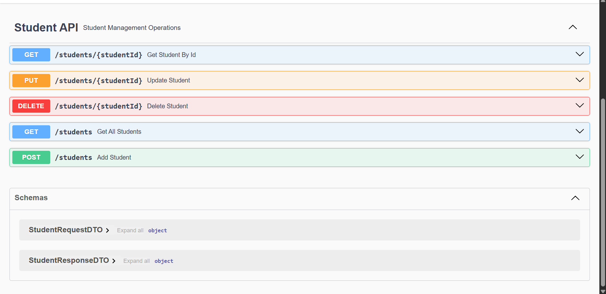
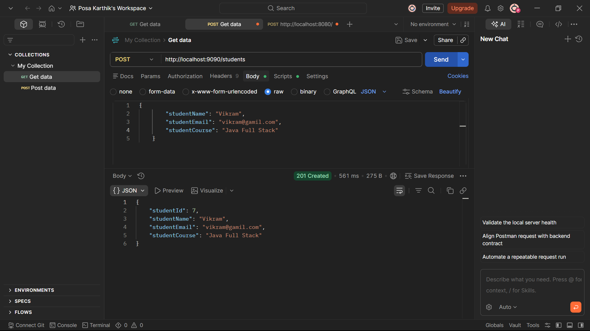
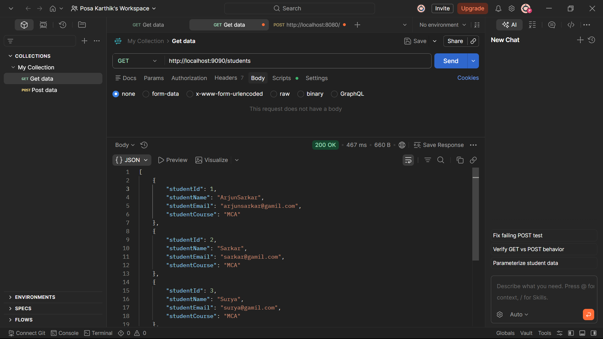
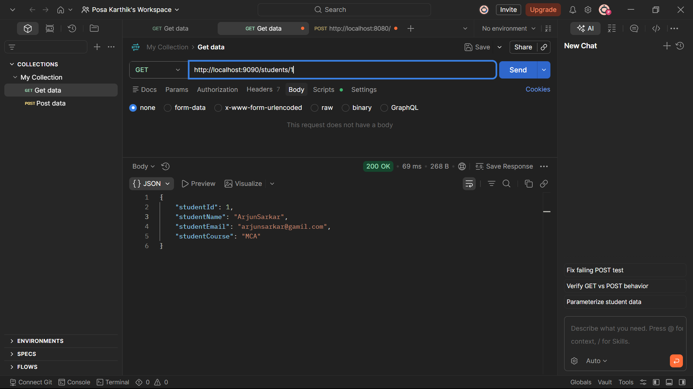
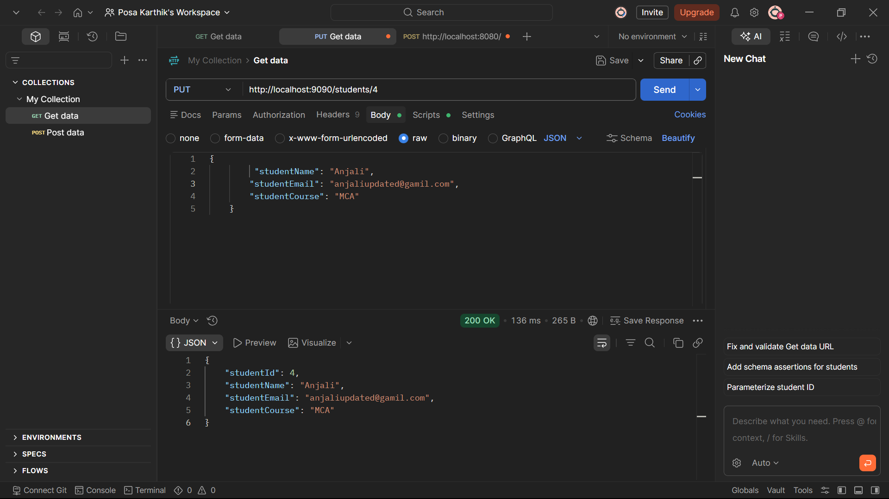
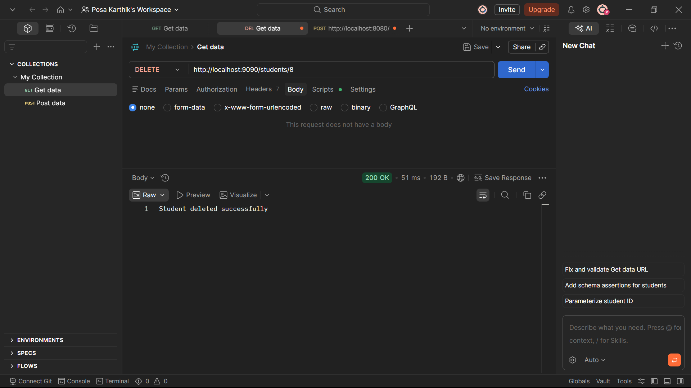
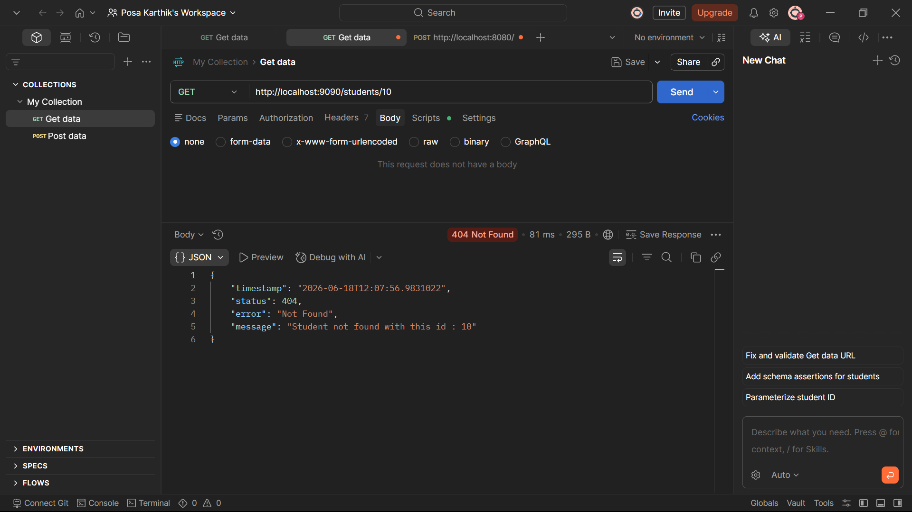

# 🎓 Student Management System REST API

A RESTful web service built using **Java, Spring Boot, Spring Data JPA, MySQL, Lombok, and Swagger OpenAPI** for managing student records.

This application follows a layered architecture and provides complete CRUD operations with DTO-based request/response handling, global exception handling, and API documentation.

---

## 🚀 Features

- Add Student
- Get All Students
- Get Student By ID
- Update Student Details
- Delete Student
- Auto Generated Student ID
- DTO Pattern Implementation
- ResponseEntity Support
- Global Exception Handling
- Structured Error Response
- MySQL Database Integration
- Swagger/OpenAPI Documentation
- Lombok Integration

---

## 🛠️ Technologies Used

- Java 17
- Spring Boot
- Spring MVC
- Spring Data JPA
- Hibernate
- REST APIs
- MySQL
- Lombok
- Swagger / OpenAPI
- Maven
- Git & GitHub

---

## 📂 Project Structure

```text
src/main/java

com.sms
│
├── controller
│   └── StudentController
│
├── service
│   ├── StudentService
│   └── StudentServiceImpl
│
├── repository
│   └── StudentRepository
│
├── entity
│   └── Student
│
├── dto
│   ├── StudentRequestDto
│   └── StudentResponseDto
│
├── exception
│   ├── StudentNotFoundException
│   ├── ErrorResponse
│   └── GlobalExceptionHandler
│
└── StudentManagementSystemApplication
```

---

## 🗄️ Database Schema

### Student Table

| Column Name | Data Type |
|------------|-----------|
| student_id | INT AI PK |
| student_name | VARCHAR   |
| student_email | VARCHAR   |
| student_course | VARCHAR   |

### Entity Configuration

```java
@Id
@GeneratedValue(strategy = GenerationType.IDENTITY)
private Integer studentId;
```

Student IDs are automatically generated by the database.

---

## 📌 API Endpoints

| Method | Endpoint | Description |
|----------|----------|----------|
| POST | `/students` | Add Student |
| GET | `/students` | Get All Students |
| GET | `/students/{id}` | Get Student By ID |
| PUT | `/students/{id}` | Update Student |
| DELETE | `/students/{id}` | Delete Student |

---

## 📮 Sample Request

### Add Student

**POST** `/students`

```json
{
  "studentName": "Arjun Sarkar",
  "studentEmail": "arjun@gmail.com",
  "studentCourse": "MCA"
}
```

### Response

```json
{
  "studentId": 1,
  "studentName": "Arjun Sarkar",
  "studentEmail": "arjun@gmail.com",
  "studentCourse": "MCA"
}
```

---

## ⚠️ Exception Handling

If a student is not found:

```json
{
  "timestamp": "2026-06-18T10:30:25",
  "status": 404,
  "error": "Not Found",
  "message": "Student not found with id : 100"
}
```

---

## 📖 Swagger Documentation

After running the application:

```text
http://localhost:8080/swagger-ui/index.html
or
http://localhost:8080/swagger-ui.html
```

Swagger provides interactive API documentation and allows testing APIs directly from the browser.

---

## 📷 Screenshots

### Swagger UI



### Add Student



### Get All Students



### Get Student By ID



### Update Student



### Delete Student



### Exception Handling



---

## ⚙️ How to Run the Project

### Clone Repository

```bash
git clone https://github.com/PosaKarthik/student-management-system-rest-api.git
```

### Navigate to Project

```bash
cd student-management-system-rest-api
```

### Create Database

```sql
CREATE DATABASE student_db;
```

### Configure Database

Update `application.properties`

```properties
spring.datasource.url=jdbc:mysql://localhost:3306/student_db
spring.datasource.username=root
spring.datasource.password=your_password

spring.jpa.hibernate.ddl-auto=update
spring.jpa.show-sql=true

server.port=9090 (custom)
```

### Run Application

Using Maven:

```bash
 mvn spring-boot:run
```

or run:

```java
//StudentManagementSystemApplication.java
```

### Open Swagger UI

```text
http://localhost:8080/swagger-ui/index.html
```

---

## 🎯 Learning Outcomes

Through this project, I learned:

- Building RESTful APIs using Spring Boot
- DTO Pattern Implementation
- Spring Data JPA & Hibernate
- MySQL Database Integration
- CRUD Operations
- Layered Architecture
- Exception Handling
- ResponseEntity Usage
- Lombok for Boilerplate Reduction
- Swagger/OpenAPI Documentation
- Git & GitHub Version Control

---

## 👨‍💻 Author

**Posa Karthik**

📧 Email: posakarthik16@gmail.com

🔗 GitHub: https://github.com/PosaKarthik

🔗 LinkedIn: https://www.linkedin.com/in/posa-karthik-225353408

---

